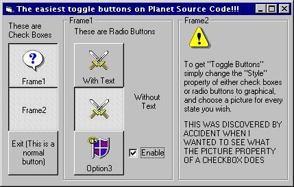



## REAL Easy Toggle Buttons

### Description

This is the easiest toggle buttons on PSC!!!
 
### More Info
 
The style porperty has to be set to "Graphical" for this to work.

             |
---                |---
**Submitted On**   |2000-11-28 00:50:30
**By**             |[VeeJay](https://github.com/Planet-Source-Code/PSCIndex/blob/master/ByAuthor/veejay.md)
**Level**          |Beginner
**User Rating**    |4.8 (24 globes from 5 users)
**Compatibility**  |VB 4\.0 \(32\-bit\), VB 5\.0, VB 6\.0
**Category**       |[Custom Controls/ Forms/  Menus](https://github.com/Planet-Source-Code/PSCIndex/blob/master/ByCategory/custom-controls-forms-menus__1-4.md)
**World**          |[Visual Basic](https://github.com/Planet-Source-Code/PSCIndex/blob/master/ByWorld/visual-basic.md)
**Archive File**   |[CODE\_UPLOAD1213811272000\.zip](https://github.com/Planet-Source-Code/veejay-real-easy-toggle-buttons__1-13169/archive/master.zip)

